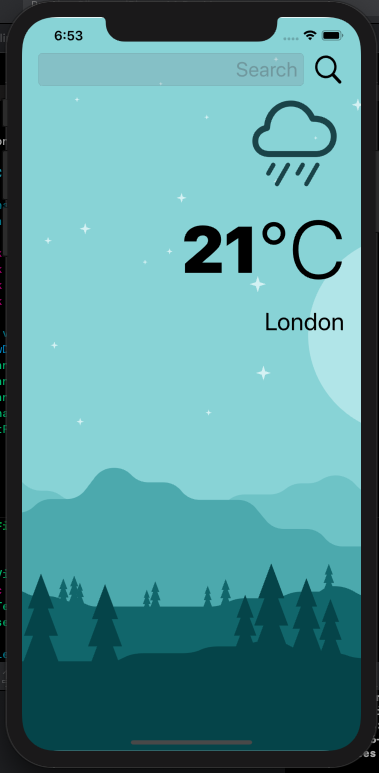
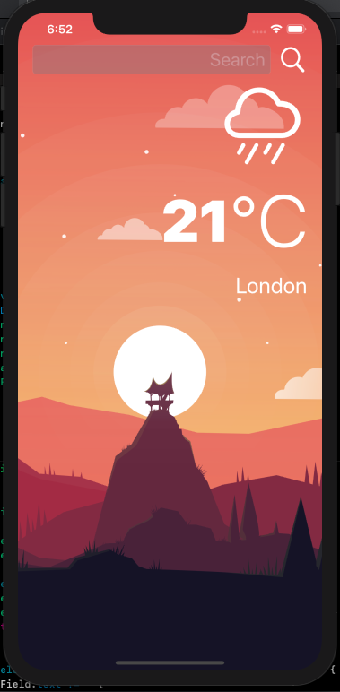

# Clima
An iOS weather app which uses OpenWeatherMap API to display current weather data for any city and your current location. Also adapts to dark mode by changing app design.
Uses SFSymbols.

## Screenshots

 

## To Run
- Make a account on OpenWeatherMap and get api keys
- Clone repo using Xcode Source Control
- Run app on preferred simulator

## Requirement
- iOS 13.x
- Xcode 11.x

